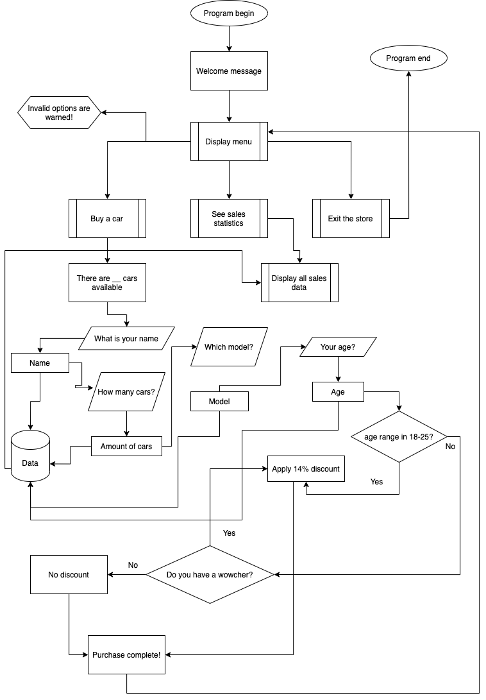

# Introduction to programming, Trimester 1, CourseWork 1

_Module code: 2021 MOD003212 TRI1 F01CAM_

[- Github](https://github.com/nuriddinislamov/aru-intro-to-programming-assessment)

### About the program

This CLI application was developed to fulfill the assessment's requirements and does not represent an actual company or service.

### Flow



### Additional topics used

-   Ternary operators
-   Making the program multiplatform

### Compiling and running

```bash
$ make
```

or

```bash
$ gcc main.c -o main && ./main
```

### Warning ⚠️

Program will attempt to create a file **data.csv** and **main** (binary executable) in the root directory of the project, so please bare that in mind and don't move files.

### Static content

You will find 2 types of static assets that contribute towards this project:

-   Diagram
-   Pluralsight engagement report

### License

[MIT Licence](/LICENSE)
This program is completely non-commercial and open source. ONLY for education purposes – assessment submission.

### Copyright

_Anglia Ruskin University, Cambridge, United Kingdom_

<center><i>© 2021</i></center>
